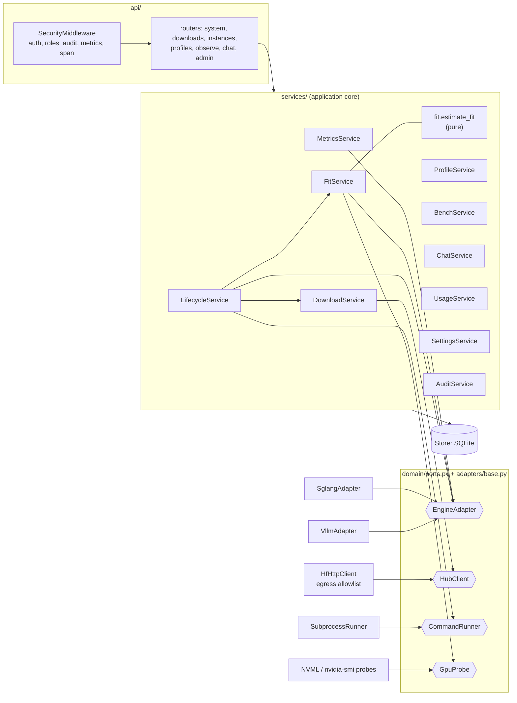

# C4 level 3: backend components

```mermaid
flowchart LR
  subgraph http["api/"]
    sec["SecurityMiddleware<br/>auth, roles, audit, metrics, span"]
    routers["routers: system, downloads, instances,<br/>profiles, observe, chat, admin"]
  end
  subgraph core["services/ (application core)"]
    fit[FitService] --- fitfn["fit.estimate_fit<br/>(pure)"]
    lc[LifecycleService]
    dl[DownloadService]
    pr[ProfileService]
    mt[MetricsService]
    bn[BenchService]
    ch[ChatService]
    us[UsageService]
    st[SettingsService]
    au[AuditService]
  end
  subgraph ports["domain/ports.py + adapters/base.py"]
    ea{{EngineAdapter}}
    hub{{HubClient}}
    run{{CommandRunner}}
    gp{{GpuProbe}}
  end
  vllm[VllmAdapter] --> ea
  sgl[SglangAdapter] --> ea
  hfh[HfHttpClient<br/>egress allowlist] --> hub
  sub[SubprocessRunner] --> run
  nvml[NVML / nvidia-smi probes] --> gp
  sec --> routers --> core
  lc --> ea & run & fit & dl
  fit --> ea & gp
  dl --> hub
  mt --> ea
  core --> store[("Store: SQLite")]
```

Wiring lives in `container.py` (`build_container`), which accepts fakes for every port so tests run offline.
