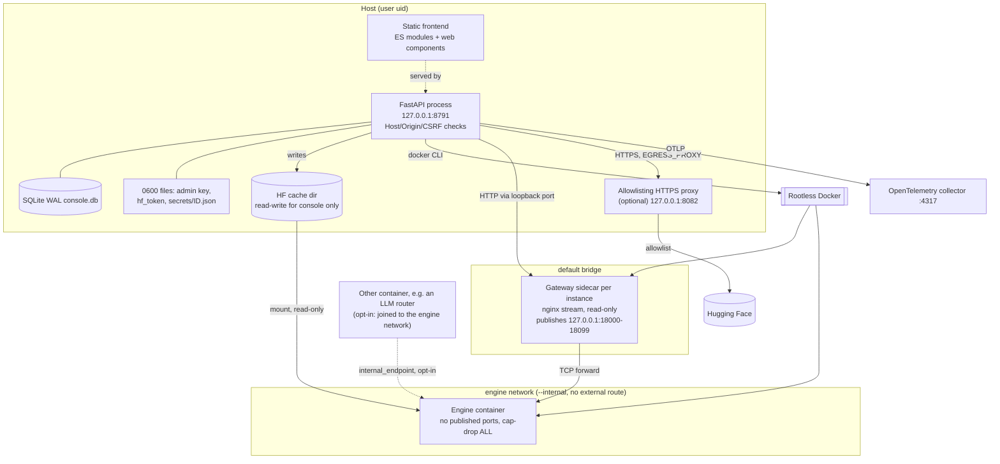

# C4 level 2: containers (deployable units)

External engines discovered at start-up (ADR-0013) are not drawn: they are monitored read-only over their own
loopback endpoint or container metadata and are never attached to the engine network or given a gateway by the console.
