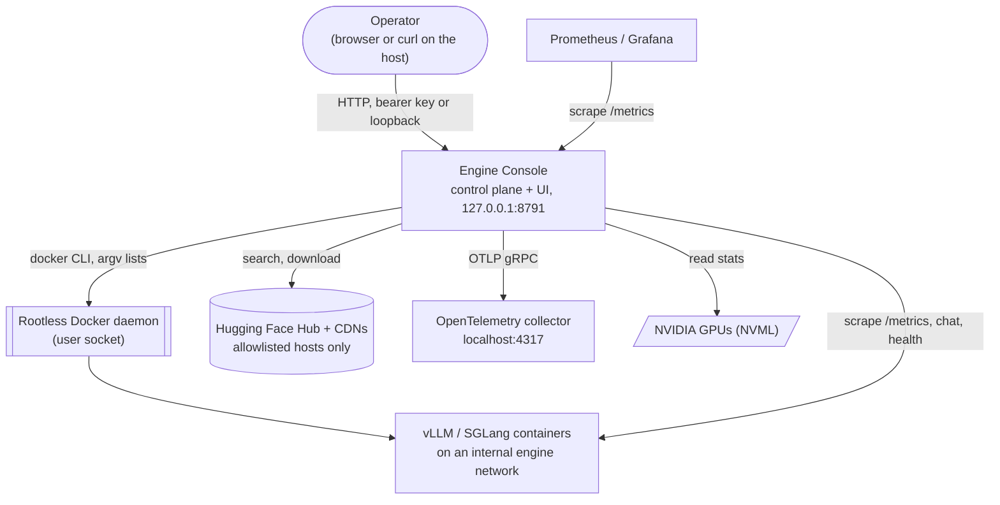

# C4 level 1: system context

```mermaid
flowchart TB
  op(["Operator<br/>(browser or curl on the host)"])
  ec["Engine Console<br/>control plane + UI, 127.0.0.1:8791"]
  docker[["Rootless Docker daemon<br/>(user socket)"]]
  eng["vLLM / SGLang containers<br/>on an internal engine network"]
  hf[("Hugging Face Hub + CDNs<br/>allowlisted hosts only")]
  otel["OpenTelemetry collector<br/>localhost:4317"]
  prom["Prometheus / Grafana"]
  gpu[/"NVIDIA GPUs (NVML)"/]
  op -->|HTTP, bearer key or loopback| ec
  ec -->|docker CLI, argv lists| docker
  docker --> eng
  ec -->|scrape /metrics, chat, health| eng
  ec -->|search, download| hf
  ec -->|OTLP gRPC| otel
  prom -->|scrape /metrics| ec
  ec -->|read stats| gpu
```
