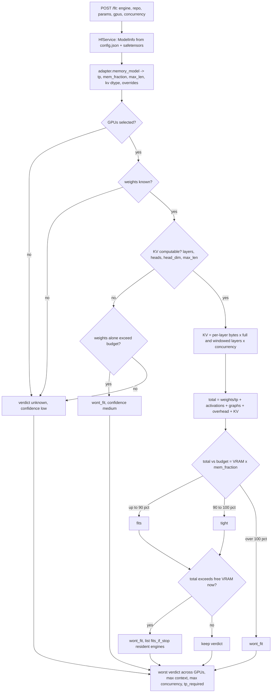

# Flow: fit estimation

```mermaid
flowchart TD
  A[POST /fit: engine, repo, params, gpus, concurrency] --> B[HfService: ModelInfo from config.json + safetensors]
  B --> C[adapter.memory_model -> tp, mem_fraction, max_len, kv dtype, overrides]
  C --> D{"GPUs selected?"}
  D -- no --> U[verdict unknown, confidence low]
  D -- yes --> E{"weights known?"}
  E -- no --> U
  E -- yes --> F{"KV computable? layers, heads, head_dim, max_len"}
  F -- no --> G{"weights alone exceed budget?"}
  G -- yes --> W[wont_fit, confidence medium]
  G -- no --> U
  F -- yes --> H[KV = per-layer bytes x full and windowed layers x concurrency]
  H --> I[total = weights/tp + activations + graphs + overhead + KV]
  I --> J{"total vs budget = VRAM x mem_fraction"}
  J -- "up to 90 pct" --> K[fits]
  J -- "90 to 100 pct" --> L[tight]
  J -- "over 100 pct" --> W2[wont_fit]
  K --> M{"total exceeds free VRAM now?"}
  L --> M
  M -- yes --> N["wont_fit, list fits_if_stop resident engines"]
  M -- no --> O[keep verdict]
  O --> P["worst verdict across GPUs, max context, max concurrency, tp_required"]
  N --> P
  W --> P
  W2 --> P
  U --> P
```
