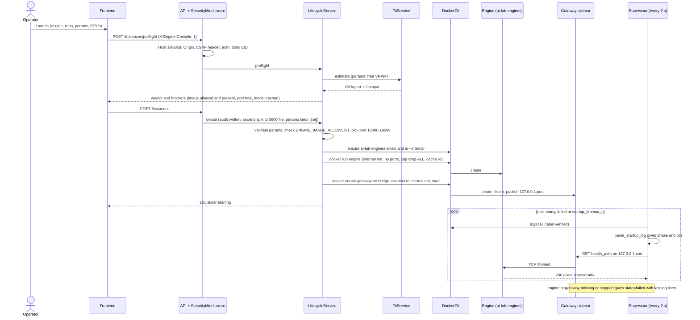

# Sequence: starting an engine

```mermaid
sequenceDiagram
  actor Op as Operator
  participant UI as Frontend
  participant API as API + SecurityMiddleware
  participant LC as LifecycleService
  participant FIT as FitService
  participant DK as DockerCli
  participant ENG as Engine (ai-lab-engines)
  participant GW as Gateway sidecar
  participant SUP as Supervisor (every 2 s)
  Op->>UI: Launch (engine, repo, params, GPUs)
  UI->>API: POST /instances/preflight (X-Engine-Console: 1)
  API->>API: Host allowlist, Origin, CSRF header, auth, body cap
  API->>LC: preflight
  LC->>FIT: estimate (params, free VRAM)
  FIT-->>LC: FitReport + Compat
  LC-->>UI: verdict and blockers (image allowed and present, port free, model cached)
  UI->>API: POST /instances
  API->>LC: create (audit written, secrets split to 0600 file, params keep [set])
  LC->>LC: validate params, check ENGINE_IMAGE_ALLOWLIST, pick port 18000-18099
  LC->>DK: ensure ai-lab-engines exists and is --internal
  LC->>DK: docker run engine (internal net, no ports, cap-drop ALL, cache ro)
  DK->>ENG: create
  LC->>DK: docker create gateway on bridge, connect to internal net, start
  DK->>GW: create, listen, publish 127.0.0.1:port
  LC-->>UI: 201 state=starting
  loop until ready, failed or startup_timeout_s
    SUP->>DK: logs tail (label verified)
    SUP->>SUP: parse_startup_log gives phase and pct
    SUP->>GW: GET health_path on 127.0.0.1:port
    GW->>ENG: TCP forward
    ENG-->>SUP: 200 gives state=ready
  end
  Note over SUP,GW: engine or gateway missing or stopped gives state=failed with last log lines
```
