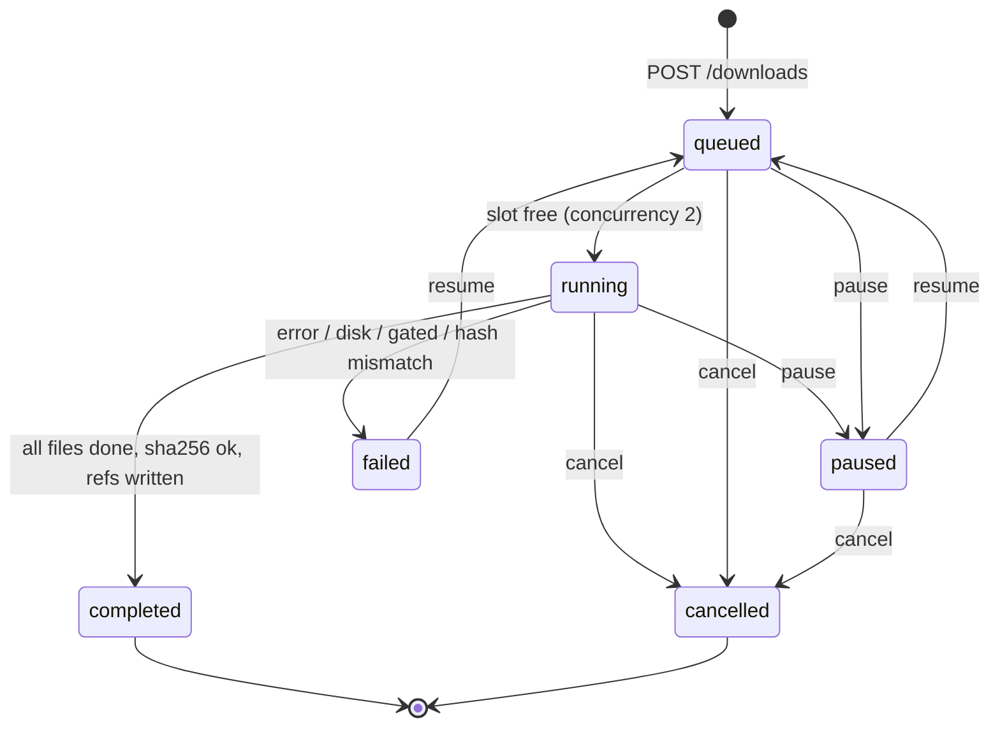

# State machine: download

States from `DownloadState` in `domain/models.py`; transitions from `services/downloads.py`.

On console restart `recover()` parks rows left `running` or `queued` as `paused` so they can be resumed.
