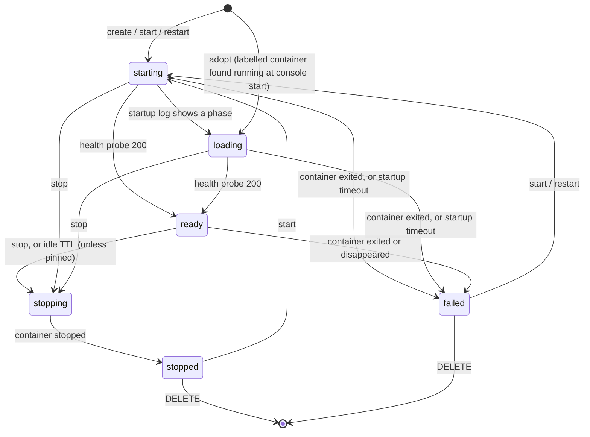

# State machine: instance

`InstanceState` = stopped, starting, loading, ready, stopping, failed (`services/lifecycle.py`).

```mermaid
stateDiagram-v2
  [*] --> starting: create / start / restart
  starting --> loading: startup log shows a phase
  starting --> ready: health probe 200
  loading --> ready: health probe 200
  starting --> failed: container exited, or startup timeout
  loading --> failed: container exited, or startup timeout
  ready --> failed: container exited or disappeared
  ready --> stopping: stop, or idle TTL (unless pinned)
  starting --> stopping: stop
  loading --> stopping: stop
  stopping --> stopped: container stopped
  failed --> starting: start / restart
  stopped --> starting: start
  stopped --> [*]: DELETE
  failed --> [*]: DELETE
  [*] --> loading: adopt (labelled container found running at console start)
```
